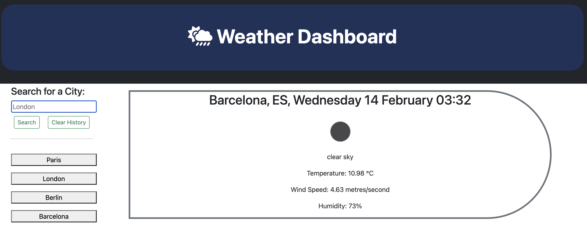
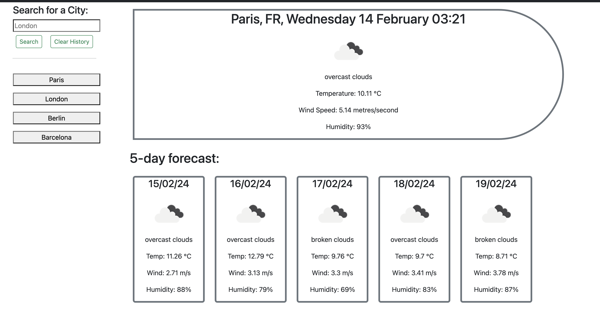

# Weather-Dashboard

## Description

This application is a Weather Dashboard which can be use in checking the current and forcasted weather for multiple cities. This app runs in the browser, and features dynamically updated HTML and CSS powered by JavaScript. The application was developed using day.js alongside jQuery syntax. Additionally, Bootstrap formatting is used.

API used: [Weather Forecast](https://openweathermap.org/forecast5)

## Installation

Simply click on the URL and you will be navigated to the web application on your default browser.[follow the link](https://martinokaf.github.io/Weather-Dashboard/).

- Visit the project repository or navigate to the website by clicking the link above 
- Explore the website by typing the city of your choice into the search bar and click the 'search' button.
- Click the buttons to cycle through your history and view the forecasts for any previously viewed cities!

## Usage

By typing the name of the city into the search bar and selecting the "Search" button, the user can look up any city. The selected city's weather for the next five days, starting on this date, is then shown.

The data that is shown consists of:
- Date
- Weather icon
- Temperature in Celsius
- Wind Speed in KPH
- Humidity in %

## Credits

Despite being finished independently, the project used the source code from:

- edX Boot Camps LLC
- [Open Weather](https://openweathermap.org/forecast5)
- [Bootstrap](https://getbootstrap.com/)
- [Day.js](https://day.js.org/docs/en/display/format)

## License
MIT License - Please see the Repository for more information
